# 🔍 AI For Flagging Suspicious Transactions

A comprehensive AI-powered system for detecting anomalous patterns in transactions, built with Streamlit and modern ML techniques.

## 🌟 Features

- **Real-time Anomaly Detection**: Advanced algorithms to identify suspicious transaction patterns
- **Interactive Dashboard**: Professional Streamlit-based GUI with dark theme
- **File Upload Support**: CSV and Excel file processing capabilities
- **AI-Powered Analysis**: Intelligent chat system for transaction insights
- **Multi-factor Risk Assessment**: Comprehensive scoring based on amount, location, and timing
- **Interactive Visualizations**: Charts, graphs, and geographic mapping
- **Export Capabilities**: Generate reports and export analysis results

## � System Workflow

```mermaid
flowchart TD
    A[📊 Transaction Data Input] --> B{Data Source Type}
    B -->|CSV/Excel Upload| C[📁 File Processing]
    B -->|Manual Entry| D[✏️ Form Input]
    B -->|API Integration| E[🔌 Real-time Data]
    
    C --> F[🧹 Data Validation & Cleaning]
    D --> F
    E --> F
    
    F --> G[🔍 Feature Engineering]
    G --> H[📈 Statistical Analysis]
    
    H --> I{Anomaly Detection Engine}
    I --> J[🤖 ML Algorithm Analysis]
    I --> K[📊 Rule-based Scoring]
    I --> L[🧠 AI Pattern Recognition]
    
    J --> M[🎯 Risk Score Calculation]
    K --> M
    L --> M
    
    M --> N{Risk Assessment}
    N -->|High Risk| O[🚨 Suspicious Flag]
    N -->|Medium Risk| P[⚠️ Review Required]
    N -->|Low Risk| Q[✅ Normal Transaction]
    
    O --> R[📋 Detailed Analysis Report]
    P --> R
    Q --> S[📊 Summary Statistics]
    
    R --> T[🎨 Interactive Visualization]
    S --> T
    
    T --> U[💬 AI Chat Analysis]
    U --> V[📤 Export Results]
    
    V --> W[📧 Alert Notifications]
    V --> X[📁 Report Generation]
    V --> Y[📊 Dashboard Updates]
    
    style A fill:#e1f5fe
    style O fill:#ffebee
    style P fill:#fff3e0
    style Q fill:#e8f5e8
    style U fill:#f3e5f5
    style V fill:#e0f2f1
```



## �🚀 Live Demo

🌐 **Production URL**: [https://your-app-name.onrender.com](https://your-app-name.onrender.com)

## 📋 Table of Contents

- [Features](#-features)
- [Installation](#-installation)
- [Local Development](#-local-development)
- [Deployment](#-deployment)
- [CI/CD Pipeline](#-cicd-pipeline)
- [Configuration](#-configuration)
- [Usage](#-usage)
- [API Documentation](#-api-documentation)
- [Contributing](#-contributing)
- [License](#-license)

## 🛠 Installation

### Prerequisites

- Python 3.9+ (Python 3.11 recommended)
- Git
- Virtual environment tool (venv, conda, etc.)

### Local Setup

1. **Clone the repository**:
   ```bash
   git clone https://github.com/yourusername/AI-For-Flagging-Suspicious-Transactions.git
   cd AI-For-Flagging-Suspicious-Transactions
   ```

2. **Create and activate virtual environment**:
   ```bash
   # Using venv
   python -m venv .venv
   
   # Windows
   .venv\Scripts\activate
   
   # macOS/Linux
   source .venv/bin/activate
   ```

3. **Install dependencies**:
   ```bash
   pip install --upgrade pip
   pip install -r requirements.txt
   ```

4. **Set up environment variables**:
   ```bash
   cp .env.example .env
   # Edit .env file with your configuration
   ```

5. **Run the application**:
   ```bash
   streamlit run main_gui_enhanced.py
   ```

6. **Access the application**:
   Open your browser to `http://localhost:8501`

## 🔧 Local Development

### Project Structure

```
AI-For-Flagging-Suspicious-Transactions/
├── .github/
│   └── workflows/
│       └── ci.yml                 # CI/CD pipeline configuration
├── src/
│   ├── backend/                   # Backend logic and ML models
│   ├── frontend/                  # UI components and integrations
│   ├── database/                  # Database management
│   ├── utils/                     # Utility functions
│   └── data/                      # Data processing modules
├── config/
│   └── app_config.yaml           # Application configuration
├── data/
│   └── sample_transactions.csv   # Sample transaction data
├── main_gui_enhanced.py          # Main application entry point
├── requirements.txt              # Python dependencies
├── Dockerfile                    # Docker configuration
├── render.yaml                   # Render deployment configuration
├── .env.example                  # Environment variables template
└── README.md                     # This file
```

### 🏗️ Technical Architecture

```mermaid
graph TB
    subgraph "Frontend Layer"
        A[🎨 Streamlit UI]
        B[📊 Plotly Visualizations]
        C[💬 AI Chat Interface]
    end
    
    subgraph "Application Layer"
        D[🚀 Main GUI Enhanced]
        E[🔧 Configuration Manager]
        F[📁 File Upload Handler]
    end
    
    subgraph "Processing Engine"
        G[🧹 Data Preprocessor]
        H[🔍 Feature Engineer]
        I[🤖 ML Anomaly Detector]
        J[📊 Statistical Analyzer]
    end
    
    subgraph "AI Integration"
        K[🧠 Ollama Chat Integration]
        L[🎯 Risk Scoring Engine]
        M[📈 Pattern Recognition]
    end
    
    subgraph "Data Layer"
        N[(📊 Transaction Database)]
        O[📁 CSV/Excel Files]
        P[🔄 Sample Data]
    end
    
    subgraph "External Services"
        Q[🌐 Ollama API]
        R[☁️ Render Deployment]
        S[🔐 Environment Config]
    end
    
    A --> D
    B --> D
    C --> D
    
    D --> E
    D --> F
    
    F --> G
    G --> H
    H --> I
    H --> J
    
    I --> L
    J --> L
    K --> L
    
    K --> Q
    L --> M
    
    G --> N
    G --> O
    G --> P
    
    D --> R
    E --> S
    
    style A fill:#e3f2fd
    style K fill:#f3e5f5
    style I fill:#e8f5e8
    style L fill:#fff3e0
    style N fill:#fce4ec
    style R fill:#e0f2f1
```



### Development Commands

```bash
# Run application in development mode
streamlit run main_gui_enhanced.py --server.port 8501

# Run tests
pytest tests/ -v

# Code formatting
black .
isort .

# Linting
flake8 .
pylint src/

# Security scan
bandit -r src/
safety check
```

## 🔄 CI/CD Pipeline




```mermaid
flowchart LR
    A[👨‍💻 Developer Push] --> B[📡 GitHub Repository]
    B --> C{🔍 GitHub Actions}
    
    C --> D[🧹 Code Quality Check]
    C --> E[🧪 Run Tests]
    C --> F[🔒 Security Scan]
    
    D --> G{All Checks Pass?}
    E --> G
    F --> G
    
    G -->|✅ Yes| H[🚀 Deploy to Render]
    G -->|❌ No| I[📧 Notify Developer]
    
    H --> J[🌐 Live Application]
    I --> K[🔧 Fix Issues]
    K --> A
    
    J --> L[📊 Health Monitoring]
    L --> M[📈 Performance Metrics]
    
    style A fill:#e3f2fd
    style G fill:#fff3e0
    style H fill:#e8f5e8
    style I fill:#ffebee
    style J fill:#e0f2f1
```

## 🌐 Deployment

### Deploy to Render (Recommended)

Render provides free hosting for web applications with automatic deployments from GitHub.

#### Step 1: Prepare Your Repository

1. **Push your code to GitHub**:
   ```bash
   git add .
   git commit -m "Prepare for deployment"
   git push origin main
   ```

#### Step 2: Set Up Render Service

1. **Create Render Account**:
   - Go to [render.com](https://render.com)
   - Sign up with your GitHub account

2. **Create New Web Service**:
   - Click "New +" → "Web Service"
   - Connect your GitHub repository
   - Select your suspicious transactions flagging repository

3. **Configure Deployment Settings**:
   ```
   Name: anomaly-detector
   Environment: Python 3
   Build Command: pip install -r requirements.txt
   Start Command: streamlit run main_gui_enhanced.py --server.port=$PORT --server.address=0.0.0.0 --server.headless=true
   ```

4. **Set Environment Variables**:
   ```
   STREAMLIT_SERVER_HEADLESS=true
   STREAMLIT_SERVER_PORT=$PORT
   STREAMLIT_SERVER_ADDRESS=0.0.0.0
   STREAMLIT_THEME_BASE=dark
   STREAMLIT_BROWSER_GATHER_USAGE_STATS=false
   ```

#### Step 3: Configure GitHub Secrets for CI/CD

1. **Get Render Deploy Hook**:
   - In Render dashboard, go to your service
   - Navigate to "Settings" → "Deploy Hook"
   - Copy the deploy hook URL

2. **Add GitHub Secret**:
   - Go to your GitHub repository
   - Click "Settings" → "Secrets and variables" → "Actions"
   - Click "New repository secret"
   - Name: `RENDER_DEPLOY_HOOK`
   - Value: Your Render deploy hook URL

#### Step 4: Configure Automatic Deployments

1. **Enable Auto-Deploy**:
   - In Render, go to "Settings" → "Auto-Deploy"
   - Enable "Auto-Deploy" for the main branch

2. **Verify Deployment**:
   - Push changes to main branch
   - Watch the deployment in Render dashboard
   - Access your live application at the provided URL

### Alternative Deployment Options

#### Docker Deployment

1. **Build Docker Image**:
   ```bash
   docker build -t anomaly-detector .
   ```

2. **Run Container**:
   ```bash
   docker run -p 8501:8501 anomaly-detector
   ```

#### Heroku Deployment

1. **Install Heroku CLI**
2. **Create Heroku App**:
   ```bash
   heroku create your-app-name
   ```
3. **Deploy**:
   ```bash
   git push heroku main
   ```

## 🔄 CI/CD Pipeline

Our GitHub Actions pipeline includes:

### Pipeline Stages

1. **Code Quality & Linting**:
   - Black code formatting check
   - isort import sorting
   - flake8 style checking
   - pylint code analysis
   - bandit security scanning
   - safety dependency checking

2. **Build & Test**:
   - Multi-Python version testing (3.9, 3.10, 3.11)
   - Unit tests with pytest
   - Code coverage reporting
   - Application startup testing

3. **Security Scanning**:
   - Comprehensive security analysis
   - Dependency vulnerability checking
   - Security report generation

4. **Docker Build**:
   - Container image building
   - Container testing

5. **Deployment**:
   - Automatic deployment to Render
   - Post-deployment health checks
   - Integration testing

6. **Notification**:
   - Deployment status reporting
   - Pipeline summary

### Triggering Deployments

- **Automatic**: Push to `main` branch triggers deployment
- **Manual**: Use GitHub Actions "Run workflow" button
- **Pull Requests**: Run tests but skip deployment

## ⚙️ Configuration

### Environment Variables

Create a `.env` file based on `.env.example`:

```env
# Application Configuration
APP_NAME="AI For Flagging Suspicious Transactions"
APP_VERSION="1.0.0"
ENVIRONMENT="development"
LOG_LEVEL="INFO"

# Streamlit Configuration
STREAMLIT_SERVER_HEADLESS=false
STREAMLIT_SERVER_PORT=8501
STREAMLIT_THEME_BASE="dark"

# Database Configuration (if using)
DATABASE_URL="your_database_url"
SUPABASE_URL="your_supabase_url"
SUPABASE_KEY="your_supabase_key"

# AI/ML Configuration
OLLAMA_HOST="localhost"
OLLAMA_PORT="11434"

# Security
SECRET_KEY="your_secret_key"
```

### Application Configuration

Edit `config/app_config.yaml`:

```yaml
app:
  name: "AI For Flagging Suspicious Transactions"
  version: "1.0.0"
  debug: false

anomaly_detection:
  threshold_high: 1000000  # 10 lakh INR
  threshold_medium: 500000  # 5 lakh INR
  risk_score_high: 0.9
  risk_score_medium: 0.6
  risk_score_low: 0.2

ui:
  theme: "dark"
  page_title: "AI For Flagging Suspicious Transactions"
  page_icon: "🔍"
```

## 📖 Usage

### 📱 User Interaction Flow

```mermaid
sequenceDiagram
    participant U as 👤 User
    participant UI as 🎨 Streamlit UI
    participant BE as ⚙️ Backend Engine
    participant AI as 🤖 AI System
    participant DB as 💾 Data Store
    
    U->>UI: Upload transaction file
    UI->>BE: Process file data
    BE->>DB: Store transaction data
    
    BE->>BE: Validate & clean data
    BE->>BE: Feature engineering
    
    BE->>AI: Run anomaly detection
    AI->>AI: ML analysis + risk scoring
    AI->>BE: Return risk scores
    
    BE->>UI: Analysis results
    UI->>U: Display visualizations
    
    U->>UI: Request AI insights
    UI->>AI: Chat query
    AI->>AI: Generate analysis
    AI->>UI: AI response
    UI->>U: Show insights
    
    U->>UI: Export results
    UI->>BE: Generate report
    BE->>U: Download report
```



### File Upload

1. **Supported Formats**: CSV, Excel (.xlsx, .xls)
2. **Required Columns**:
   - `Transaction_ID`: Unique identifier
   - `Transaction_Amount`: Amount in INR
   - `Transaction_Type`: Type of transaction
   - `Location`: Transaction location
   - `Timestamp`: Transaction timestamp

### Sample Data Format

```csv
Transaction_ID,Transaction_Amount,Transaction_Type,Location,Timestamp
TXN001,1500000,Transfer,Mumbai,2025-09-01 10:30:00
TXN002,50000,Purchase,Delhi,2025-09-01 11:15:00
TXN003,2000000,Withdrawal,Bangalore,2025-09-01 12:00:00
```

### Risk Assessment

- **High Risk** (Score: 0.9): Transactions > ₹10 lakh
- **Medium Risk** (Score: 0.6): Transactions > ₹5 lakh
- **Low Risk** (Score: 0.2): Transactions < ₹5 lakh

## 🔧 API Documentation

### Health Check Endpoint

```
GET /_stcore/health
```

Returns application health status.

### File Upload API

The application provides a web interface for file uploads. Programmatic access can be implemented using Streamlit's session state.

## 🤝 Contributing

1. **Fork the repository**
2. **Create feature branch**: `git checkout -b feature/amazing-feature`
3. **Commit changes**: `git commit -m 'Add amazing feature'`
4. **Push to branch**: `git push origin feature/amazing-feature`
5. **Open Pull Request**

### Development Guidelines

- Follow PEP 8 style guidelines
- Write comprehensive tests
- Update documentation
- Ensure security best practices

## 🔒 Security

- All dependencies are regularly scanned for vulnerabilities
- Input validation on all file uploads
- Secure environment variable handling
- Regular security audits with bandit and safety

## 📝 License

This project is licensed under the MIT License - see the [LICENSE](LICENSE) file for details.

## 📞 Support

- **Issues**: [GitHub Issues](https://github.com/yourusername/AI-For-Flagging-Suspicious-Transactions/issues)
- **Discussions**: [GitHub Discussions](https://github.com/yourusername/AI-For-Flagging-Suspicious-Transactions/discussions)
- **Email**: your-email@example.com

## 🎯 Roadmap

- [ ] Enhanced ML models for anomaly detection
- [ ] Real-time data streaming support
- [ ] Advanced user authentication
- [ ] Multi-currency support
- [ ] Mobile application
- [ ] Advanced analytics dashboard
- [ ] Integration with banking APIs

## 🏆 Acknowledgments

- Streamlit team for the amazing framework
- Render for free hosting
- GitHub Actions for CI/CD
- Open source community for various libraries

---

**Made with ❤️ for financial security and transaction monitoring**
